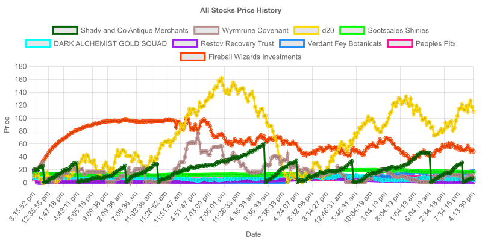
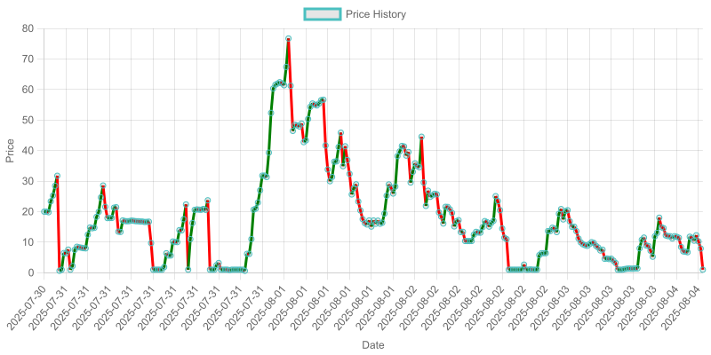

# Toy Investment Bot for Discord

IMPORTANT NOTE: the API should **not** be exposed to the open internet, it is designed to be run only on the same device as the bot - which does have proper security and validatioan implemented.  

A discord bot for a toy invesment program 

Requirements: 
    Recent version of NPM and Node
    Already created discord bot
    MYSQL Database

Setup:
1. Go through the discord bot creation process
2. Create a .env file with the format:
```
APP_ID=(Discord App Id)
DISCORD_TOKEN=(Discord Token)
PORT=(Port for the bot to run on)
API_PORT=(Port for the Api to run on)
```
3. Run `initalise.sql, addCompanies.sql, startingPrices.sql and createTrigger.sql` in that order on the MYSQL database 
4. Run `npm install` in both the API and bot subdirectories
5. Run `node app.js` in both the API and bot subdirectories
---
Discord commands:

/adduser (name - optional) - adds yourself to the database with the supplied name, otherwise uses discord username
/get (stock, ammount) - buys stock 
/sell (stock, ammount) - sells stock
/leaderboard - Shows a leaderboard if everything was sold at the present prices
/summary (name - optional) - Shows a profile summary of the name supplied, otherwise shows your own profile summary
/view (stock - optional) - Shows a history and summary of the stock supplied, otherwise shows all stocks together

---

The algorithms for each stock can be customised in the APIs `updateStockPrices.js`, some of the algorithms are: 
- Momentum based
- Random Walk
- Seasonal Effect (Yearly - Time series based)
- Geometric Brownian Motion
- Mean Reversion

And more custom basic algorithms for specific 'companies'
---

Examples:





